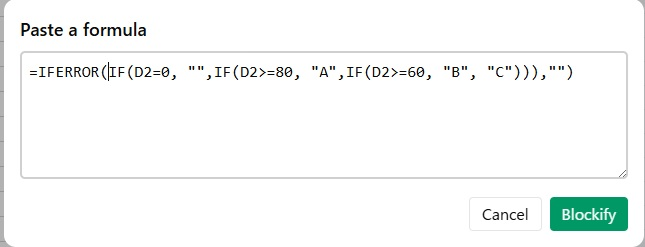
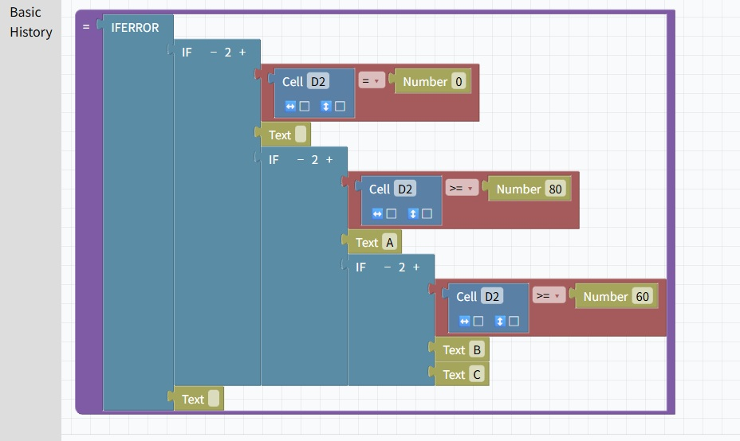
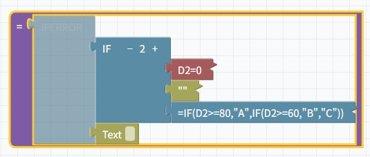
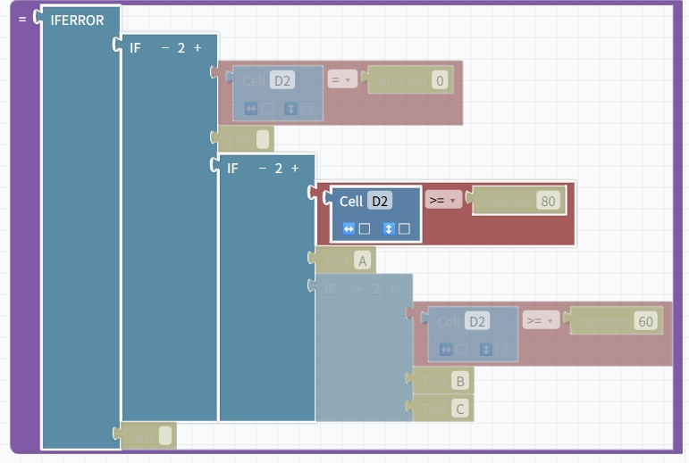

# Frockly (v0.6)

Frockly is a visual editor for understanding and refactoring complex Excel formulas.

Instead of reading long, deeply nested formulas as plain text,  
Frockly represents formulas as **blocks**, making their structure explicit and easier to inspect.

Frockly is **not an Excel replacement**.  
It focuses on helping you **read, analyze, and reason about formulas** before bringing them back into Excel.

---

## Demo

🔗 https://ryuu12358.github.io/Frockly/

- Desktop and mobile layouts are supported  
- Desktop is recommended for large formulas  
- Mobile view is optimized for inspection and navigation

---

## What Frockly does

- Build Excel formulas by assembling blocks
- Convert existing Excel formulas into block structures
- Inspect complex formulas using structural views  
  (collapse, focus, root)
- Define and reuse named formulas
- Import data and formulas from `.xlsx` files (experimental)
- Copy completed formulas back into Excel or spreadsheet tools

---

## What Frockly does NOT do

- Edit cell values
- Recalculate formulas
- Save or modify Excel files

Frockly is designed for **understanding and refactoring**, not execution.

---

## Example

### Same formula, different levels of visibility

Below is the same Excel formula shown in different representations.

#### Original formula (text)
All structure is hidden in a single line.

```excel
=IFERROR(IF(D2=0,"",IF(D2>=80,"A",IF(D2>=60,"B","C"))),"")
```

### 1. Import from formula
Paste an existing Excel formula and convert it into blocks instantly.



---

### 2. Structured view
The logical structure is laid out visually.
Nested conditions become explicit branches.



---

### 3. Focused / collapsed view
Collapse irrelevant branches and focus on the part you are reasoning about.



---

### 4. Path view
Trace which logical path is taken for a specific condition.

This makes decision flows visible without mentally simulating nested IFs.



---

## Why Frockly?

Excel formulas are often hard to understand not because they are complex,  
but because their **structure is hidden inside a single line of text**.

As formulas grow, we end up mentally reconstructing their structure every time we read them.

Frockly externalizes that structure,  
so you can **see how a formula is built**, instead of re-deriving it in your head.

---

## Status

Current version: **v0.6**

Most core ideas are implemented.  
The project is still experimental, but usable for real inspection and refactoring workflows.

---

## Updates

- **2026-01-05** – v0.6  
  Mobile view support  
  Optimized layout and interactions for mobile inspection and navigation
- **2025-12-25** – v0.5  
  File tab, `.xlsx` import, named function import/export
- **2025-12-22** – View tab for formula structure visualization
- **2025-12-20** – Function description panel
- **2025-12-19** – Formula → block conversion
- **2025-12-17** – Initial public release

---

## Roadmap (rough)

### Structural assistance
- Check tab (structural diagnostics, LET refactoring hints)

### Usability
- Improved named function navigation

### Internationalization
- i18n infrastructure (UI strings, function descriptions)
- Multilingual function search
- Community-driven translations (planned)

---

## Notes

Frockly explores a different way of interacting with formulas.

It does not aim to automate thinking or generate logic for you,  
but to make **existing logic visible and easier to reason about**.


---

☕ Support

If you enjoy this project or find it useful,  
you can support its development here:

[](https://buymeacoffee.com/tqanothumew)
